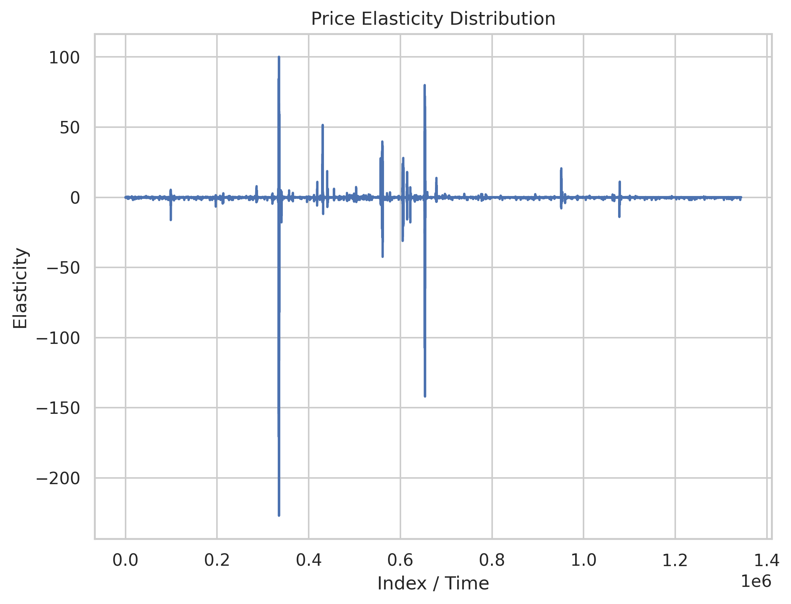

# M5 Causal Inference & Price Elasticity Modeling

An end-to-end causal machine learning pipeline designed to estimate heterogeneous price elasticity of demand and minimize retail food waste using the M5 Forecasting dataset.

---

## 📌 Experiment Overview

Traditional retail forecasting and pricing models often suffer from bias due to unobserved promotional events, seasonal shifts, and lagging moving averages. This project addresses these challenges through two core pillars:
1. **Demand Forecasting & Inventory Simulation**: Replacing heuristic 7-day moving averages with **XGBoost** to align stock ordering with true day-of-week demand patterns.
2. **Causal Price Elasticity & Dynamic Markdowns**: Utilizing **Double Machine Learning (DML)** and **Causal Forests** to isolate the true causal effect of price changes ($T$) on sales ($Y$) while controlling for temporal confounders ($W$).

### Pipeline Workflow
* **Data Ingestion & Downcasting:** Merges store sales, calendars, and price data into memory-optimized parquet tables.
* **Confounder Generation:** Extracts lag features, rolling statistics (7 to 28-day means/stds), and calendar/holiday attributes.
* **Causal Estimation:** Fits `CausalForestDML` on orthogonalized residuals using LightGBM base learners to compute heterogeneous price elasticities ($\epsilon = \frac{\partial \log(Y)}{\partial \log(T)}$).
* **Policy Tree Decision Rules:** Translates continuous causal effects into interpretable if-then rules for store managers to automate markdown timing.

---

## 📊 Experimental Outcomes & Relation to Food Waste Reduction

The experimental runs yielded critical insights into how advanced machine learning and causal inference directly minimize store shrinkage and retail food waste:
* **XGBoost Inventory Simulation:**  
  * Shifting from a naive moving-average baseline to XGBoost achieved a **10.16% total reduction in food waste** over evaluation windows (reducing spoiled units from 14,239 down to 12,791).  
  * When benchmarked at equivalent product availability (~89.5% service level), XGBoost slashed waste by **15.70%** (saving 1,965 units) while maintaining a high **91.02% service level**.
* **Causal Price Sensitivity & Dynamic Markdowns:**  
  * The **FOODS** category exhibited the highest price sensitivity (mean elasticity $\approx \mathbf{-1.65}$), proving that grocery items are highly responsive to price adjustments.  
  * Translating causal estimates into an operational decision tree successfully generated a clearance dispatch queue that **diverted 868 perishable units from landfills** and **recovered $1,280.46 in clearance revenue** that would have otherwise been written off as total shrinkage.
* **Why It Matters for Food Waste:** 
  Perishable items have strict expiration windows (e.g., 1–3 days). By combining accurate demand forecasts with data-driven dynamic markdowns (e.g., targeted 10%–20% clearance triggers for volatile near-expiry SKUs), stores can accelerate sell-through velocity right before expiration, turning potential waste into recovered revenue without eroding profit margins on items that sell organically.

---

## 📷 Architecture & Results Visualizations

### 1. Causal Pipeline & Impact Dashboard
<p align="center">
  
</p>
*Figure: Multi-panel dashboard showcasing estimated CATE price elasticity distributions, operational markdown recommendations, counterfactual waste reduction impact, and causal drift audits.*

### 2. Price Elasticity Distribution Across Categories
<p align="center">
  
</p>
*Figure: Longitudinal and categorical view tracking the trajectory and volatility of price elasticity across items.*

---

## 🚀 Getting Started

### 1. Installation
Clone the repository and install dependencies:
```bash
git clone [https://github.com/kesjien/m5-causal-elasticity.git](https://github.com/kesjien/m5-causal-elasticity.git)
cd m5-causal-elasticity

# Set up virtual environment
python -m venv .venv
source .venv/bin/activate  # On Windows: .venv\Scripts\activate

# Install requirements
pip install -r requirements.txt